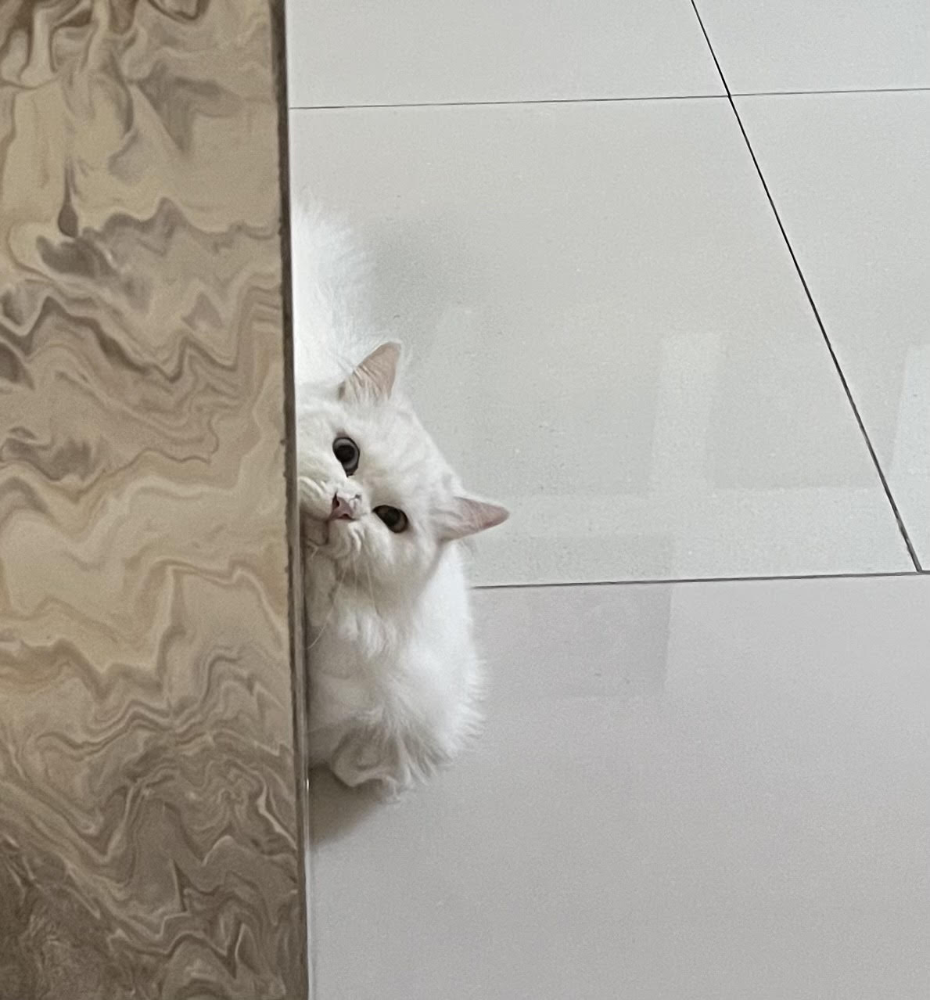

# Introduction
Hi! I'm **Salsa**, a student in the **Framework-Based Software Design and Development course**. 
I expect to learn a lot about modern software maintenance practices and how to work with legacy systems.

I enjoy learning about different aspects of **Software Development**, especially **Front-end Development** and building interactive web experiences.

- **Course expectations:** To deepen my understanding of framework-based development and gain hands-on experience in building software with modern frameworks.
- **Fun fact:** I'm a big mama cat 🐱 with six adorable cats at home! Here’s one of my adorable fur babies:

## GitHub Profile

You can view my personalized GitHub profile (https://github.com/Reeedr12)

